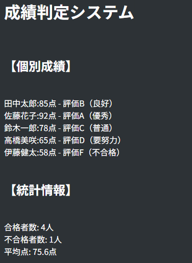

# php-control-practice

## 概要
COACHTECH 教材 Tutorial 7-2「制御構文 ハンズオン演習」で作成した成果物です。

条件分岐や配列、関数を使って成績判定システムを作成した。

## 使用技術
PHP 8.2

タイトルや見出しにHTMLを使用した。

## 学んだこと
・HTMLのどこにPHPを入れるのかが難しかった。AIやコーチに相談したり、調べたりした。
・関数の定義が出来るようになった。
・foreachループや演算子が難しく少し時間がかかった。調べてこの課題では使えるようになったが、どこでも使えるように理解を深めていく。

## 動作確認
こまめにブラウザを開き、書き換えたらどう動くかを確認した。
